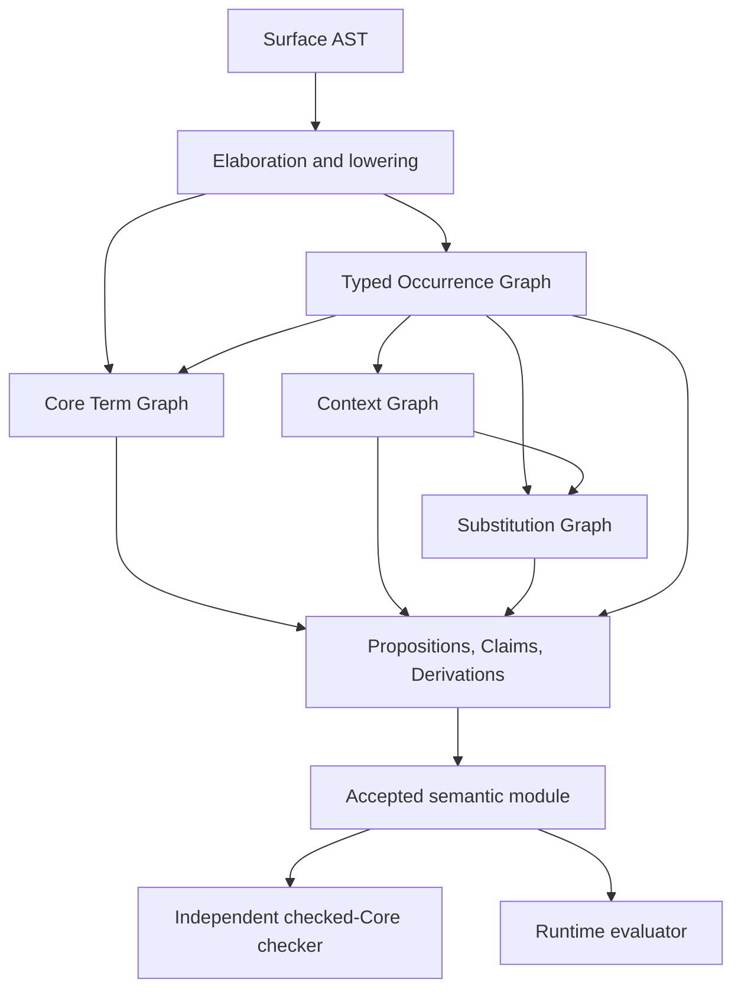
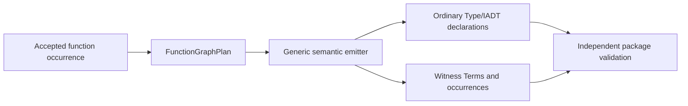
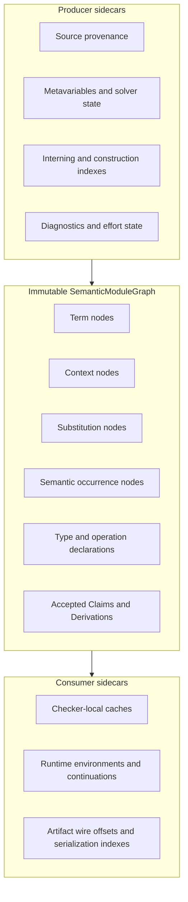

# Current Term Graph, Context Boundaries, and Codebase Consolidation Audit

Date: 2026-08-27 17:40:40 JST

Revalidated: 2026-08-28 JST

Status: source-level audit and proposed migration sequence; no implementation
refactoring is authorized by this document

This document records a source-level consolidation audit of the current A
Program implementation. Its conclusions are intended to support a separately
reviewed implementation plan and later implementation work.

The audit asks a narrow question:

> If the Term graph is the principal representation of an A Program program,
> which surrounding data structures are mathematically necessary, and which
> parts are duplicated only because compiler phases currently use separate
> physical records?

The answer is not that every structure should become a Term. Values, types, and
computations should be represented by Terms, but Contexts, Substitutions,
typed occurrences, and derivations represent different mathematical objects.
The main opportunity is to give each semantic fact one immutable owner and to
move construction state, indexes, caches, source provenance, and runtime state
into explicit sidecars.

## Audit status and baseline

The implementation checkout was updated before this audit.

```text
Repository: a-program/
Branch:     main
Commit:     8cff173b81d63e1df2c67801f43dc7ae1de5c7c2
Subject:    correct issue 23 line accounting
```

The implementation built successfully. The dedicated issue 23 integration test
passed all six phases, including generated dependent motives, indexed controls,
two-recursive-call Quicksort induction hypotheses, rejection cases, and the
checked-Core authority boundary.

The complete upstream integration suite currently does not pass at this
baseline. It discovers 53 tests but stops at the fifth test,
`test_checked_core_examples`, because checked-Core rejects
`explicit_index_family_acc_concrete_check.p`. At that point four tests have
passed, one has failed, and 48 have not executed. This audit does not classify
that failure as caused by the consolidation candidates below; it records the
failure so that a documentation-only pull request does not claim a green
baseline.

The ordinary user `PATH` in this workspace contains an `rg` compatibility
wrapper that does not implement positive `--glob` filtering correctly. The
first integration-test attempt therefore made an audit script search itself
and produced a false failure. Repeating the test with the actual ripgrep
binary produced 52 passes. This is an environment/tooling defect, not an A
Program implementation failure.

Issue 23's dependent Function Graph motive and induction-hypothesis work is now
implemented. The external book workspace's `posthoc_length_property.p` compiles
successfully at this baseline. Its aggregate `make check` still fails later
because a book check script expects a pure Match result not to enter a dependent
family; that expectation is now stale relative to the implementation. Future
consolidation must preserve the new issue 23 positive and negative regression
tests.

The audited C, header, and include-fragment volume is approximately 177,678
lines. The largest units are investigation leads rather than proof of
duplication. Paths in the following table are relative to
`src/prototype/src/`:

| Implementation unit | Approximate lines | Principal responsibility |
| --- | ---: | --- |
| `frontend/lowering/graph_construction.inc` | 11,312 | Surface lowering, graph rebuilding, constraints |
| `frontend/function_graph.c` | 9,044 | Generated Function Graph packages and witnesses |
| `kernel/typing/accepted_replay.inc` | 7,902 | Replay of accepted derivations |
| `checker/session.c` | 7,245 | Independent checked-Core session |
| `identity/object_term_action.inc` | 6,156 | Object/identity action over Terms |
| `frontend/lowering/context_and_type_lowering.inc` | 6,044 | Context-sensitive elaboration and type lowering |
| `core/term/evaluation_and_conversion.inc` | 5,029 | Core evaluation and conversion |
| `frontend/lowering/constraint/evidence_and_freeze.inc` | 4,367 | Constraint evidence and freezing |
| `frontend/lowering/constraint/motive_solver.inc` | 4,063 | Dependent motive equations and solver integration |

Large files are not automatically wrong. A consolidation is justified only
when it removes a duplicated semantic authority, duplicated pure algorithm, or
unnecessary physical copying.

## The current semantic path

The following diagram separates the principal representations.



The Term graph is principal in the following precise sense:

- every value is represented by a Term;
- every type or classifier is represented by a Term;
- every computation is represented by a Term;
- other semantic structures refer to Terms instead of defining competing
  value, type, or computation languages.

This does not imply that a Context, a Substitution, or a typing occurrence is a
Term. They answer different questions:

| Structure | Question answered |
| --- | --- |
| Term | What expression, type, value, or computation is this? |
| Context | Under which ordered assumptions is it meaningful? |
| Substitution | How is data in one Context reindexed into another? |
| Typed occurrence | Which source occurrence uses this Term, in which Context, under which typing rule? |
| Derivation | Why is the asserted judgement accepted? |

The proposed consolidation therefore places these node kinds in one semantic
module graph without pretending that they are one node kind.

## Why the Context is not merely the free variables of a Term

The user's initial intuition is partly correct: the Term graph contains the
program, while Context information appears where open Terms depend on local
variables. The important qualification is that a Context is an ordered,
dependent telescope rather than an unordered free-variable set.

Consider the Context:

```text
Γ = A : Type, x : A, p : P A x
```

It was constructed in three steps:

```text
Γ₀ = ·
Γ₁ = Γ₀, A : Type
Γ₂ = Γ₁, x : A
Γ₃ = Γ₂, p : P A x
```

The order matters. The classifier of `x` uses `A`, and the classifier of `p`
uses both `A` and `x`. A set such as `{A, x, p}` loses the dependency order and
does not say where each classifier is checked.

The mathematical extension rule is:

```inference
Γ context
Γ ⊢ A type
x is a fresh binder
---
Γ, x : A context
@ context extension
```

The current implementation structurally realizes this rule. Context entry zero
is empty, and every non-empty Context record stores a parent, a binder identity,
a classifier reference, an extension kind, and optional producer-computation
information. Contexts are interned immutable extensions rather than copied
arrays.

The implementation therefore already avoids the naive cost of copying an
entire telescope for each extension. What it does not currently provide is a
general computation of a smallest dependency-closed support Context.

### Why `FV(t)` is insufficient

Suppose `Γ ⊢ t : A`. A support calculation must include more than the free
variables occurring syntactically in `t`:

```text
support(t : A)
  = FV(t)
  ∪ FV(A)
  ∪ transitive dependencies of every included binder classifier
  ∪ dependencies required by effect and sequence-result evidence
```

For example, `t` may be the variable `p`. The syntax of `p` mentions neither
`A` nor `x`, but its classifier `P A x` depends on both.

Weakening introduces a second obstruction to treating free variables as the
canonical Context. A Term may be valid in a larger Context containing unused
variables:

```inference
Γ ⊢ t : A
Γ ⊢ B type
y is fresh
---
Γ, y : B ⊢ t : A
@ weakening
```

Thus, the same Term and classifier can occur in several Contexts. The Term
graph cannot choose one uniquely.

In a future linear or affine fragment, removing an apparently unused binder
may itself require resource evidence. A general-purpose Context compactor must
therefore be parameterized by the structural rules admitted by the relevant
fragment.

### A safe support-Context optimization

A Program may later compute a dependency-closed `Γsupport` for an occurrence
originally checked in `Γ`. The result must include a projection Substitution:

```text
π : Γ → Γsupport
```

A Term checked in `Γsupport` may then be reindexed along `π` for use in `Γ`.
This is an optional artifact and memory optimization; it is not a replacement
for Context semantics.

Current implementation status: Context extension, ancestry, projection,
composition, and reindexing have concrete structural representations. General
minimal-support calculation and resource-sensitive thinning are not currently
implemented.

## Why Term identity cannot absorb typed occurrences

Core Term interning intentionally erases some source distinctions. For
example, two alpha-equivalent lambdas can share a structural Core
representation even when their printed binder names and classifiers differ.

```text
\x : Bool => x
\y : Nat  => y
```

The exact amount of sharing depends on the internal Term schema and binding
representation, but the architectural invariant is clear: Core identity does
not own source spelling, source AST identity, or the complete typing occurrence.

The typed occurrence record consequently stores information including:

- the Context ID;
- the source and reindexed Core Terms;
- the source and asserted classifiers;
- the Context-action Substitution;
- the application role;
- source AST and symbol identities;
- exact binder identity;
- Match motive and induction-hypothesis ownership;
- solver status and residual verification obligation;
- child edges, cases, and computation-fold clauses.

This overlay is necessary. However, these fields have four different
lifetimes and trust roles, which is the source of avoidable duplication.

## Finding C1: split semantic records from construction sidecars

The highest-leverage general consolidation is to separate immutable semantic
facts from mutable mechanisms used to create or locate them.

### Context

The producer-side `prototype_context` contains both semantic fields and
interning fields:

```text
semantic:
  parent
  binding_id
  classifier_ref
  extension_kind
  producer_computation

derived/indexing:
  depth
  key_hash
  hash_next
```

The checker then receives a separate `prototype_semantic_context` containing a
copy of the finalized semantic subset.

The proposed split is:

```text
ContextSemantic
  parent
  binding
  classifier
  extension_kind
  producer_computation

ContextElaborationState
  provisional classifier or metavariable reference

ContextIndex
  depth
  interning hash links
  statistics
```

After freezing, the checker can read the same immutable
`ContextSemantic[]` bytes. Sharing bytes does not make the producer
authoritative: the checker must still independently verify every asserted
classifier and extension.

### Substitution

The same split applies to Substitutions:

```text
SubstitutionSemantic
  kind
  source_context
  target_context
  first
  second
  term
  term_classifier

SubstitutionIndex
  key_hash
  hash_next
  reindex cache
  binding-image cache
  statistics
```

Substitution composition should remain a DAG node rather than being eagerly
expanded into a copied tuple. Its compositional structure is useful semantic
evidence and avoids copying. A normalized image may be cached in a sidecar when
profiling demonstrates a benefit.

### Typed occurrence

The current occurrence record should be split into:

```text
SemanticOccurrence
  occurrence kind and CBPV category
  Context and Context action
  origin/core Term references
  asserted classifier
  semantic child edges
  motive and IH ownership
  Match/fold semantic data

OccurrenceOrigin
  source AST
  printed symbols
  source binder identities

OccurrenceSolverState
  pending, solved, conditional, or residual status
  metavariables and verification obligations

OccurrenceIndex
  adjacency offsets
  source-AST reverse lookup
  hash/index data
```

The independent checker already defines a broad semantic occurrence view. The
split above allows that view to become the canonical frozen record rather than
a separately populated projection.

### Term database

The Term database itself also mixes immutable semantic arenas with builder and
runtime facilities. The target split is:

```text
TermGraph
  Terms
  Match cases and binders
  induction-hypothesis scopes
  computation-fold clauses

TermBuilder
  allocation cursor
  interning construction API

TermIndexesAndCaches
  hash indexes
  normalization/conversion caches
  rebuildable lookup tables
```

The Term representation is already the closest component to a canonical
semantic owner. This split is primarily a capability and lifetime improvement,
not a replacement of Term identity.

## Finding C2: split candidate proof search from accepted evidence

The Judgement database currently owns several distinct lifetimes:

- propositions and mutable derivation candidates used during solving;
- accepted Claims;
- accepted Derivations;
- lookup indexes and statistics.

These concepts should not be collapsed into one record. A proposition names a
judgement, a Claim is an accepted node for that proposition, and a Derivation
records the rule application supporting the Claim.

The physical aggregate can nevertheless be split:

```text
JudgementCandidateArena
  mutable propositions under consideration
  derivation candidates
  solver frontier

AcceptedDerivationGraph
  accepted Claims
  accepted rule applications and dependencies

JudgementIndexes
  hashes
  reverse indexes
  statistics
```

This makes it possible to discard proof-search state after producing an
accepted module while retaining independently replayable evidence.

Current implementation status: candidate and accepted concepts are logically
distinguished, but their storage and lifetime ownership remain grouped.

## Finding C3: replace synthetic Function Graph AST with a semantic plan

`frontend/function_graph.c` is the clearest large-scale consolidation target.
It contains separate generation paths for normal graphs, binary packages,
result types, runners, nested runners, adapters, projections, nested
projections, and terminal dependencies.

The present architecture frequently constructs synthetic Surface AST and then
sends that AST through general lowering. This has one useful property: generated
declarations pass through familiar elaboration paths. It also has substantial
costs:

- generated semantics are encoded indirectly as surface syntax;
- several package shapes require parallel emitters;
- source-origin metadata must be reconstructed;
- a generated declaration pays parsing-style and lowering-style bookkeeping
  even though its semantic structure is already known;
- tests can accidentally validate the synthetic syntax route rather than the
  intended Function Graph invariant.

Introduce a normalized, non-authoritative planning record:

```text
FunctionGraphPlan
  owner function and owner telescope
  input and output indexes
  ordered case descriptors
  recursive-call descriptors
  Graph constructor schemas
  result-family schemas
  witness clauses
  runner clauses
  local selector roles
  dependency edges
```

Generation then becomes:



The plan does not become a new semantic authority. It is a temporary normalized
description from which ordinary semantic records are emitted. The accepted
IADT declaration, Terms, occurrences, and derivations remain authoritative.

A source-AST-to-occurrence reverse index should accompany this work. Current
Function Graph helpers perform repeated linear occurrence scans to recover
origin information. The reverse index is derived data and belongs in an
indexing sidecar.

Expected benefit: this change can replace many specialized emitters with one
generic emitter and is the most plausible source of a reduction measured in
thousands of lines. An exact line target should not be promised until a
`FunctionGraphPlan` prototype demonstrates that normal, binary, nested, and
terminal cases really share one schema.

Current implementation status: Function Graph generation is operational, and
the issue 23 dependent-motive cases now have dedicated positive, negative,
Quicksort, and checked-Core tests. Generation is not yet organized around a
single semantic plan. The newly separated motive solver is a semantic rule
component that a Function Graph planning refactor must call or preserve; it is
not merely duplicate emitter plumbing.

## Finding C4: unify evaluator mechanics, not evaluation policies

There is a Core evaluator and a typed-occurrence runtime evaluator. They serve
different observations, but both implement parts of application, Match, Fold,
and continuation transition mechanics.

The typed-occurrence runtime uses a fixed-capacity environment:

```text
OperationRuntimeEnvironment
  bindings[512]
  count
```

Each extension copies the whole structure. Resumptions and request states also
embed environments and frame data. In addition, term instantiation loops over
the environment and repeatedly substitutes each bound value through the whole
Term.

This is real physical copying rather than a necessary consequence of Context
theory.

The proposed runtime representation is:

```text
EnvironmentNode
  parent_environment
  binding_id
  runtime_value

Closure
  term_id
  environment_id
```

Environment extension and resumption capture then become O(1) arena insertions.
Variable evaluation follows parent links or a cached lookup index. Whole-Term
substitution is no longer required before every evaluation step.

For ordinary sequential execution, a mutable stack with checkpoints may be
faster. Multi-shot resumptions require persistent snapshots, so a persistent
arena or chunked copy-on-write stack is the safer common representation.
Profiling should choose the final layout.

The evaluators can share a transition engine with explicit policies:

```text
TermStepMachine
  structural transition rules

Policies
  pure normalization
  effectful runtime execution
  typed-occurrence tracing
  verification-obligation handling
```

They must not share an assumption that all computations terminate. Pure
normalization, effectful execution, and future partial computation have
different admissibility conditions even when they reuse the same transition
mechanics.

Current implementation status: runtime Context and static Context are already
distinct concepts, which is correct. Runtime environment copying and repeated
Term instantiation remain concrete optimization and simplification targets.

## Finding C5: finish extracting read-only structural algorithms

The recent refactor introduced structural readers for Terms, Contexts, and
Substitutions. This is the correct direction: both producer and checker can
reuse representation-level traversal without sharing typing acceptance.

One remaining example is free-binder detection. Core substitution code defines
a recursive `term_contains_free_binder_at_depth`, while the checker implements
its own `checker_term_contains_binding`. The checker implementation covers a
narrower Term-tag set and can drift when new Term constructors are introduced.

Extract one schema-driven, read-only operation:

```text
term_structurally_contains_free_binding(reader, term, binding)
```

The operation may be shared because it only traverses an immutable Term schema.
The conclusions drawn from the result remain checker-local.

The same rule should guide future sharing:

- share child enumeration, ancestry, path traversal, binding-image lookup, and
  immutable record decoding;
- do not share the decision that a typing, conversion, resource, universe, or
  effect judgement is accepted.

Current implementation status: Context ancestry and Substitution image lookup
already use structural readers in important checker paths. Free-binding and
some Term-shape traversals remain duplicated.

## Finding C6: reduce lowering capability breadth before splitting files

The lowering context currently combines:

- semantic builders;
- lexical binder lookup;
- persistent Context prefixes;
- Judgement transaction state;
- classifier, effect, and constraint solvers;
- caches and usage tracking;
- pending declarations and diagnostics;
- effort accounting.

Merely moving portions of the large include fragments into new files would not
reduce conceptual complexity. First divide the capabilities:

```text
LoweringSemanticBuilder
  Term, Context, Substitution, occurrence, and judgement insertion

LoweringScope
  lexical binder map
  Context prefix IDs
  namespace/local selector state

LoweringSolverWorkspace
  classifier, motive, effect-row, and refinement constraints

LoweringDiagnostics
  source origin and diagnostics

LoweringEffort
  budget, suspension, and resumable work state
```

Functions should accept the narrowest capability they need. Once those
boundaries exist, the large lowering units can be split without creating broad
cross-module accessors.

### Avoid copying top-level scope arrays

Most lowering paths restore scope by restoring the binder count and current
Context prefix. Two observed paths copy the full fixed binder and Context arrays
to create a temporary top-level scope. Replace these copies with a
`LoweringScopeCheckpoint` or an isolated root-scope view.

This is a modest code and memory improvement, but it also states the correct
invariant: Context prefix arrays are a navigation aid for elaboration, not
semantic ownership distinct from the Context graph.

### Consider a defunctionalized lowering worklist

Value, computation, control, block, and Match lowering contain semantically
different CBPV rules. They should not be merged into one untyped routine.
However, much traversal and callback-style continuation plumbing can be
represented by an explicit task machine:

```text
LoweringTask
  mode: VALUE | COMPUTATION | CONTROL
  source node
  Context
  explicit continuation tag
  partial children/results
```

This can reduce repeated control flow and gives effort compilation a concrete
pause/resume representation. Rule functions remain separate by semantic
category.

Current implementation status: value and computation distinctions are
explicit, which is correct. Capability boundaries and resumable lowering tasks
are not yet represented as such.

## Finding C7: introduce phase-lifetime storage

The program-storage backing currently reserves large fixed-capacity arrays for
AST, Terms, cases, binders, Contexts, Substitutions, Judgements, occurrences,
artifacts, and runtime support in one long-lived aggregate.

This makes every compiler session pay for maximum capacities and keeps
short-lived elaboration data alive after an accepted artifact has been built.

Use separate growable or chunked arenas:

```text
SourceArena
  text, tokens, AST, printed names

ElaborationArena
  mutable constraints, provisional classifiers, candidate derivations

SemanticModuleArena
  immutable Terms, Contexts, Substitutions, occurrences, declarations,
  accepted derivations

RuntimeArena
  environments, closures, continuations, resumptions, evaluation caches
```

Batch compilation may release Source and Elaboration arenas after acceptance.
REPL and incremental modes may retain them in a producer capsule without making
them part of the checked semantic module.

Current implementation status: semantic stores have increasingly explicit
authority boundaries, but their allocation lifetimes remain tied together by
the large backing structure.

## Proposed target architecture

The resulting architecture is one immutable semantic module graph containing
several typed node sorts, plus phase-specific sidecars.



The central graph should expose immutable views and narrow builder interfaces.
No module other than the owning builder mutates semantic records. Indexes and
caches must be rebuildable and must never change the meaning of an existing
semantic ID.

## Boundaries that must remain separate

The following apparent similarities are legitimate boundaries, not deletion
candidates.

### Term and typed occurrence

One Term may have several source and typing occurrences. Folding occurrence
identity into Term identity would disable useful interning and confuse erased
Core computation with source typing evidence.

### Context and Substitution

A Context is an object of the syntactic category/CwF. A Substitution is a
morphism between Contexts. Merging their records would confuse objects with
arrows and make composition and projection less explicit.

### Static Context and runtime Environment

`x : A` and `x = v` are related but not identical. The former justifies typing;
the latter supplies an evaluated value. They may reuse a low-level persistent
stack implementation but must have distinct types and invariants.

### Proposition, Claim, and Derivation

A proposition identifies what is to be shown. A Claim says that this judgement
has been accepted. A Derivation records why. Removing these distinctions would
weaken auditability.

### Producer and checker

Sharing immutable schemas and structural readers is safe. Sharing the actual
acceptance algorithm would defeat independent checking. Resource, universe,
conversion, dependent-Match, and effect checks must remain independently
implemented or independently generated from a formally reviewed rule source.

### Accepted replay and checked-Core checking

Replay checks a supplied derivation graph. Checked-Core checking validates the
semantic module interface from its own rule implementation. Their conclusions
may coincide, but their trust roles differ.

### Live graph and artifact wire image

The wire image owns serialization layout, offsets, versioning, and external
validation. It should be generated from the semantic graph, not treated as the
same in-memory object.

### Value and computation rules

CBPV deliberately distinguishes values from computations. Similar C control
flow in the implementation does not justify merging their typing rules.

## Recommended migration sequence

The sequence below minimizes semantic risk.

### Phase 0: preserve correctness baselines

Before structural work, retain the issue 23 regression suite and ensure that
every currently supported Function Graph example, artifact round trip,
accepted replay, checked-Core check, and runtime execution has a permanent
test. Separately classify and repair the current checked-Core Acc fixture
failure so it is not mistaken for a consolidation regression.

Exit condition: consolidation preserves both accepted dependent-motive cases
and intentional rejection cases, and the full upstream baseline is green or
has an explicitly approved quarantine unrelated to the refactor.

### Phase 1: semantic records and sidecars

1. Split Term semantic arenas from builder indexes and caches.
2. Define canonical finalized Context and Substitution records.
3. Split typed occurrences into semantic, origin, solver, and index data.
4. Split candidate Judgement state from accepted evidence.
5. Make the checked module refer to the frozen semantic arrays without copying
   them into a competing record set.

Exit condition: producer and checker compute the same artifact fingerprints as
before, and indexes can be discarded and rebuilt without semantic change.

### Phase 2: Function Graph plan and direct emission

1. Add `FunctionGraphPlan` as temporary producer state.
2. Populate it from an accepted function occurrence.
3. Emit ordinary IADT/type declarations and witness Terms through low-level
   semantic builders.
4. Replace special emitters incrementally, beginning with the normal unary
   case and ending with nested and terminal cases.
5. Validate generated packages independently.

Exit condition: generated packages are semantically identical under artifact
comparison, and no synthetic Surface AST is needed for migrated cases.

### Phase 3: evaluator and environment consolidation

1. Introduce persistent environment IDs and closures.
2. Remove whole-environment copies from extension and resumption capture.
3. Replace eager repeated Term substitution with environment lookup.
4. Extract shared structural transition machinery.
5. Retain separate policies for normalization, effects, tracing, and future
   partial computation.

Exit condition: runtime results and effect traces are unchanged, multi-shot
resumptions remain correct, and environment/instantiation benchmarks improve.

### Phase 4: structural-reader completion and checker organization

1. Move free-binding and complete child traversal into schema-driven readers.
2. Keep all acceptance decisions checker-local.
3. Divide `checker/session.c` internally into Context/Substitution,
   structural conversion, dependent Match, CBPV/effects,
   declaration/interface, and session-driver components.

Exit condition: adding a Term tag produces a compile-time or test failure in
every exhaustive structural visitor, rather than silently missing a checker
path.

### Phase 5: lowering capabilities and phase arenas

1. Introduce narrow lowering capability structures.
2. Replace full scope-array copying with checkpoints.
3. Move callback continuation plumbing toward an explicit task worklist.
4. Introduce growable phase-lifetime arenas.
5. Release source and solver state after batch acceptance.

Exit condition: memory ownership is visible from types and lifetimes, and no
semantic record points into a discarded producer arena.

### Phase 6: optional Context support slicing

1. Compute free dependencies of a Term and its classifier.
2. Close transitively over binder classifiers and semantic evidence.
3. Produce a support Context and projection Substitution.
4. Parameterize admissibility by structural/resource policy.
5. Use it only for artifact compaction or diagnostics until fully audited.

Exit condition: reindexing from the support Context reconstructs the original
judgement, and linear/affine fragments never discard a resource without
evidence.

## Verification matrix

Each consolidation has a characteristic failure mode and therefore needs a
specific test family.

| Change | Principal risk | Required verification |
| --- | --- | --- |
| Shared semantic records | Producer assertion accidentally trusted | Independent checker rejects mutated fields |
| Context sidecar split | IDs change meaning after cache rebuild | Fingerprint and reindex equivalence tests |
| Occurrence split | Source identity or IH ownership lost | Alpha-sharing, dependent Match, Function Graph tests |
| Judgement lifetime split | Accepted evidence references discarded candidates | Artifact replay after producer arena release |
| FunctionGraphPlan | Special package semantics lost | Unary, binary, nested, projection, terminal, dependent-motive tests |
| Persistent runtime environment | Wrong shadowing or resumption capture | Nested bind, shadowing, one-shot and multi-shot effect tests |
| Shared Term structural reader | New tags omitted | Exhaustiveness and mutation-negative tests |
| Phase arenas | Dangling semantic references | Address sanitizer and artifact-after-release tests |
| Support Context | Invalid weakening under resource policy | Ordinary, affine, and linear policy-specific tests |

## Final assessment

The categorical Context and Substitution layer is not the main source of code
bloat. Its parent-linked Context representation and interned Substitution DAG
are already substantially more compact than repeatedly copied environments.
Removing that layer would also remove the explicit basis for weakening,
dependent reindexing, Match refinement, and proof replay.

The larger problem is physical and architectural duplication around the
semantic graph:

1. producer records mix semantic facts with construction and index state;
2. checker records copy finalized semantic subsets;
3. typed occurrences combine semantics, source origin, solver lifecycle, and
   graph indexing;
4. Function Graph generation translates known semantics back into synthetic
   Surface AST and maintains several special emitters;
5. runtime environments and Term instantiation perform large repeated copies;
6. multiple components reimplement read-only Term traversal;
7. source, solver, semantic, artifact, and runtime storage share overly broad
   lifetimes.

The appropriate unification principle is therefore:

> One immutable owner for each semantic fact; distinct typed node sorts for
> distinct mathematical objects; phase-specific sidecars for everything that
> can be rebuilt or discarded.

This preserves A Program as a Term-centered programming language while keeping
the Context, Substitution, occurrence, and derivation information required for
dependent typing, effects, later resource sensitivity, and independent
verification.
